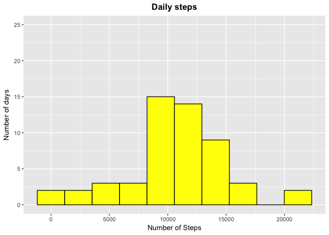
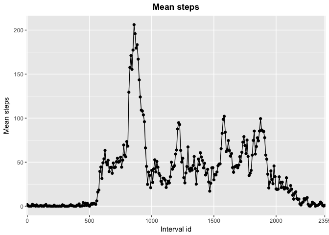
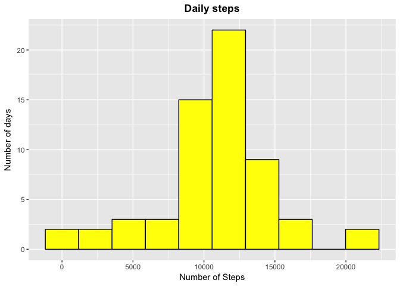
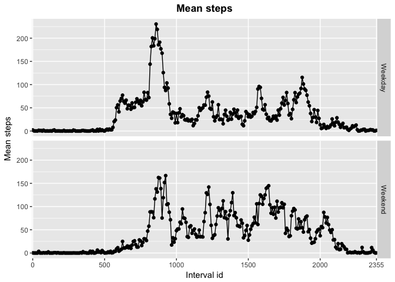

# Reproducible Research. Peer assessment 1


Activity monitoring data necessary for this assessment were downloaded from [here](https://d396qusza40orc.cloudfront.net/repdata%2Fdata%2Factivity.zip)

This assignment makes use of data from a personal activity monitoring device. This device collects data at 5 minute intervals through out the day. The data consists of two months of data from an anonymous individual collected during the months of October and November, 2012 and include the number of steps taken in 5 minute intervals each day.

This dataset include the following variables:

- **steps**: Number of steps taking in a 5-minute interval (missing values are coded as NA)

- **date**: The date on which the measurement was taken in YYYY-MM-DD format

- **interval**: Identifier for the 5-minute interval in which measurement was taken

## 1. Loading and preprocessing the data


```r
unzip('./repdata_data_activity.zip')
activity <- read.csv('activity.csv')
```

Exploring the dataset

```r
dim(activity)
```

```
## [1] 17568     3
```

```r
head(activity)
```

```
##   steps       date interval
## 1    NA 2012-10-01        0
## 2    NA 2012-10-01        5
## 3    NA 2012-10-01       10
## 4    NA 2012-10-01       15
## 5    NA 2012-10-01       20
## 6    NA 2012-10-01       25
```

```r
str(activity)
```

```
## 'data.frame':	17568 obs. of  3 variables:
##  $ steps   : int  NA NA NA NA NA NA NA NA NA NA ...
##  $ date    : Factor w/ 61 levels "2012-10-01","2012-10-02",..: 1 1 1 1 1 1 1 1 1 1 ...
##  $ interval: int  0 5 10 15 20 25 30 35 40 45 ...
```

Packages used for this assessment

```r
library(lubridate)
```

```
## 
## Attaching package: 'lubridate'
```

```
## The following object is masked from 'package:base':
## 
##     date
```

```r
library(ggplot2)
library(dplyr)
```

```
## 
## Attaching package: 'dplyr'
```

```
## The following objects are masked from 'package:lubridate':
## 
##     intersect, setdiff, union
```

```
## The following objects are masked from 'package:stats':
## 
##     filter, lag
```

```
## The following objects are masked from 'package:base':
## 
##     intersect, setdiff, setequal, union
```

Formatting dates from factor to date using the lubridate package

```r
activity$date <- ymd(activity$date)
```

## 2. What is mean total number of steps taken per day?

For this part of the assignment, missing values were ignored as instructed.

#### 2.1. Calculate the total number of steps taken per day

```r
stepsday <- with(activity, tapply(steps, yday(date), sum))
stepsday <- as.data.frame.table(stepsday)
colnames(stepsday) <- c('Days', 'Steps')
str(stepsday)
```

```
## 'data.frame':	61 obs. of  2 variables:
##  $ Days : Factor w/ 61 levels "275","276","277",..: 1 2 3 4 5 6 7 8 9 10 ...
##  $ Steps: int  NA 126 11352 12116 13294 15420 11015 NA 12811 9900 ...
```

```r
stepsday$Days <- as.numeric(as.character(stepsday$Days))
head(stepsday)
```

```
##   Days Steps
## 1  275    NA
## 2  276   126
## 3  277 11352
## 4  278 12116
## 5  279 13294
## 6  280 15420
```

The total number of steps per day is calculated. The resulting array is converted into a data frame.
The two columns are given clear names, and the Days are converted from factor to numeric.

##### 2.2. If you do not understand the difference between a histogram and a barplot, research the difference between them. Make a histogram of the total number of steps taken each day.

```r
g <- ggplot(stepsday, aes(Steps))
g + geom_histogram(bins=10, color="black", fill="yellow") + ylim(c(0,25)) +
    labs(x='Number of Steps') +
    labs(y='Number of days') +
    labs(title='Daily steps') +
    theme(plot.title = element_text(hjust=0.5, face="bold"))
```

```
## Warning: Removed 8 rows containing non-finite values (stat_bin).
```

<!-- -->

#### 2.3. Calculate and report the mean and median of the total number of steps taken per day.

```r
summary(stepsday$Steps)
```

```
##    Min. 1st Qu.  Median    Mean 3rd Qu.    Max.    NA's 
##      41    8841   10765   10766   13294   21194       8
```

The mean total number of steps per day is 10766, whereas the median is 10765. There were 8 missing values.

## 3. What is the average daily activity pattern?

#### 3.1. Make a time series plot (i.e. type = "l") of the 5-minute interval (x-axis) and the average number of steps taken, averaged across all days (y-axis).

```r
stepsint <- with(activity, tapply(steps, interval, mean, na.rm=T))
stepsint <- as.data.frame.table(stepsint)
colnames(stepsint) <- c('Interval.id', 'Mean')
```

In this case missing values were removed, otherwise mean could not be calculated.


```r
g <- ggplot(stepsint, aes(x=(Interval.id), y=Mean, group=1))
g + geom_point() + geom_line() +
    scale_x_discrete(breaks=c(0,500,1000,1500,2000,2355)) +
    labs(x='Interval id', y='Mean steps') +
    labs(title='Mean steps') +
    theme(plot.title = element_text(hjust=0.5, face="bold"))
```

<!-- -->

#### 3.2. Which 5-minute interval, on average across all the days in the dataset, contains the maximum number of steps?

```r
stepsint[stepsint$Mean==max(stepsint$Mean),]
```

```
##     Interval.id     Mean
## 104         835 206.1698
```

The maximum number of steps, 206, was contained in interval mumber 835 (row 104).

## 4. Imputing missing values

#### 4.1. Calculate and report the total number of missing values in the dataset (i.e. the total number of rows with NAs).

```r
sum(is.na(activity$steps))
```

```
## [1] 2304
```

```r
sum(is.na(activity$date))
```

```
## [1] 0
```

```r
sum(is.na(activity$interval))
```

```
## [1] 0
```

2304 missing values are present in the column steps. The other two columns have no missing values.

#### 4.2. Devise a strategy for filling in all of the missing values in the dataset. The strategy does not need to be sophisticated. For example, you could use the mean/median for that day, or the mean for that 5-minute interval, etc.

I decided to replace each missing value in a 5-min interval with the mean for that interval. The dataset with these means was generated earlier (stepsint).

#### 4.3. Create a new dataset that is equal to the original dataset but with the missing data filled in.

```r
stepsint$Interval.id <- as.numeric(as.character(stepsint$Interval.id))
activity2 <- activity

for (row in 1:nrow(activity2)) {
     if (is.na(activity2$steps[row])) {
        activity2[row,1] <- stepsint[stepsint$Interval.id==activity2$interval[row],2]
    }
    else next
}
```

This chunck of code generates a copy of the original dataset with the activity data.
The for loop goes through every row of the activity2 dataset. The if condition checks every row of the steps column for missing data. If the condition is true, the steps value from the stepsint dataset, column 2, corresponding to the Interval containing the NA in activity2 is passed to activity2 to replace the NA.

#### 4.4. Make a histogram of the total number of steps taken each day and calculate and report the mean and median total number of steps taken per day. Do these values differ from the estimates from the first part of the assignment? What is the impact of imputing missing data on the estimates of the total daily number of steps?

```r
stepsday2 <- with(activity2, tapply(steps, yday(date), sum, na.rm=T))
stepsday2 <- as.data.frame.table(stepsday2)
colnames(stepsday2) <- c('Days', 'Steps')

g <- ggplot(stepsday2, aes(Steps))
g + geom_histogram(bins=10, color="black", fill="yellow") +
    labs(x='Number of Steps') +
    labs(y='Number of days') +
    labs(title='Daily steps') +
    theme(plot.title = element_text(hjust=0.5, face="bold"))
```

<!-- -->

A new dataset with the total number of steps per day (stepsday2) and the corresponding histogram were generated. 

The new mean and median of the total number of steps taken per day with imputed values are:

```r
summary(stepsday2$Steps)
```

```
##    Min. 1st Qu.  Median    Mean 3rd Qu.    Max. 
##      41    9819   10766   10766   12811   21194
```

The mean and the median did not vary from the those calculated with NAs. However, the values of the 1st and 3rd quartiles have changed, and there is an increase of the number of days with an average number of steps around the mean.

## 5. Are there differences in activity patterns between weekdays and weekends?

#### 5.1. Create a new factor variable in the dataset with two levels – “weekday” and “weekend” indicating whether a given date is a weekday or weekend day.

```r
activity2$day <- weekdays(activity2$date)
for (row in 1:nrow(activity2)) {
    if (activity2$day[row] %in% c('Saturday', 'Sunday'))
        activity2$day[row] <- 'Weekend'
    else
        activity2$day[row] <- 'Weekday'
}
```
I have extracted the days of the week from the activity2 dadaset and added the column day to the same dataset. Then, the for loop converted the days into Weekend or Weekday.

#### 5.2. Make a panel plot containing a time series plot (i.e. type = "l") of the 5-minute interval (x-axis) and the average number of steps taken, averaged across all weekday days or weekend days (y-axis).

```r
stepswday <- with(activity2[activity2$day=='Weekday',], tapply(steps, interval, mean, na.rm=T))
stepswday <- as.data.frame.table(stepswday)
colnames(stepswday) <- c('Interval.id', 'Mean')
stepswday$type.day <- 'Weekday'

stepswend <- with(activity2[activity2$day=='Weekend',], tapply(steps, interval, mean, na.rm=T))
stepswend <- as.data.frame.table(stepswend)
colnames(stepswend) <- c('Interval.id', 'Mean')
stepswend$type.day <- 'Weekend'

stepsday3 <- bind_rows(stepswday, stepswend)
rm(stepswday, stepswend)
```

Generation of two data frames with the average steps taken per 5-min interval. These data frames are then merged into one data frame (stepsday3) with averages for Weekdays and for the Weekend.


```r
g <- ggplot(stepsday3, aes(x=(Interval.id), y=Mean, group=1))
g + geom_point() + geom_line() +
    facet_grid(type.day~.) +
    scale_x_discrete(breaks=c(0,500,1000,1500,2000,2355)) +
    labs(x='Interval id', y='Mean steps') +
    labs(title='Mean steps') +
    theme(plot.title = element_text(hjust=0.5, face="bold"))
```

<!-- -->

Making a panel with two graphs showing the average steps taken in 5-min interval on weekdays and weekend.
